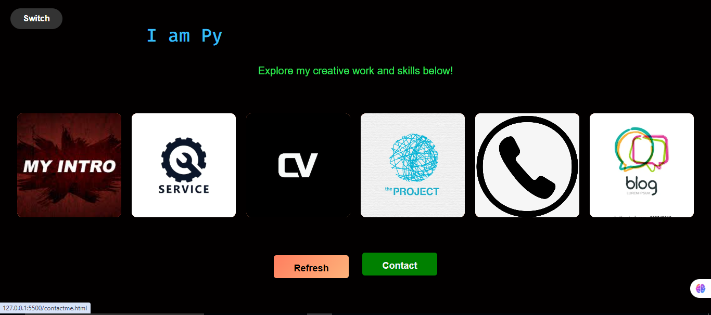

# 💼 Jawad Abbasi - Portfolio Website

Welcome to my **personal portfolio website**!  
This site showcases my skills, projects, and passion for technology. Built using pure HTML and CSS, it's designed to be clean, professional, and responsive across devices. 🌐✨

🔗 **Live Website**: [Click here to visit my portfolio](https://jawadabbasi14.github.io/my-portfolio-website/)

## 🧑‍💻 About the Website

This website includes:

- 👨‍🎨 A modern and minimal UI
- 🧩 Sections like Home, Services, Projects, and Contact
- 🌗 Dark Mode & Light Mode switch
- 📱 Fully responsive design for mobile, tablet, and desktop

## 🖼️ Preview Screenshots

### 🌞 Light Mode Preview

### 🌙 Dark Mode Preview

---

## 🚀 Technologies Used

- HTML5  
- CSS3  
- Git & GitHub for version control

---

## 🙌 Thank you!

Feel free to explore, fork, or contribute. Let’s build something great together! 💻🚀
